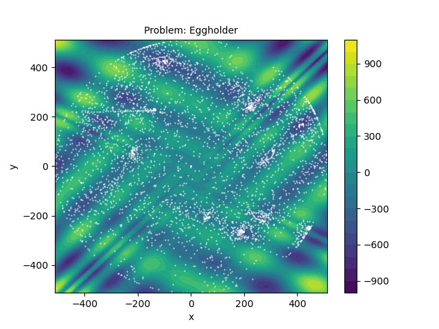

# rt_opt: Run-and-tumble global optimizer

Metaheuristic global optimization algorithm combining a bacterial run-and-tumble chemotactic search
(see, e.g., [here](https://www.ncbi.nlm.nih.gov/pmc/articles/PMC5418374/)) with a local,
gradient-based search around the best minimum candidate points.
The algorithm's goal is to find the global minimum of an objective function f over a (possibly
bounded) region Ω, that is, to find

<p style="text-align: center;">
min f(x), x ∈ Ω, <br/>
f: Ω ⊂ ℝ<sup>n</sup> → ℝ.
</p>

For the local, gradient-based search, a bounded BFGS algorithm is used.

Since the chemotactic search becomes more and more ineffective with increasing problem
dimensionality,
[Sequential Random Embeddings](http://www.lamda.nju.edu.cn/huyq/papers/ijcai16-sre.pdf) are used
to solve the optimization problem once its dimensionality exceeds a given threshold. The idea of
Sequential Random Embeddings is basically to reduce high-dimensional problems to low-dimensional
ones by embedding the original, high-dimensional search space ℝ<sup>n</sup> into a low dimensional
one, ℝ<sup>m</sup>, by sequentially applying the random linear transformation

<p style="text-align: center;">
x<sub>0</sub> = 0<br>
x<sub>k+1</sub> = α<sub>k+1</sub>x<sub>k</sub> + A • y<sub>k+1</sub>,<br>
x ∈ ℝ<sup>n</sup>,&nbsp;&nbsp;&nbsp;&nbsp;y ∈ ℝ<sup>m</sup>,&nbsp;&nbsp;&nbsp;&nbsp;
A ∈ N(0, 1)<sup>n×m</sup>,&nbsp;&nbsp;&nbsp;&nbsp;α ∈ ℝ,
</p>

and minimizing the objective function f(α<sub>k+1</sub>x<sub>k</sub> + A • y<sub>k+1</sub>) w.r.t.
(α<sub>k+1</sub>, y<sub>k+1</sub>) for each k in a given range.

## Installation
rt_opt can be most conveniently installed via pip:
```
pip install rt_opt
```

## Usage
For a quick start, try to find the global minimum of the
[Eggholder function](https://www.sfu.ca/~ssurjano/egg.html) within the default square
x<sub>i</sub> ∈ [-512, 512] ∀ i = 1, 2:
```
import time

import numpy as np

from rt_opt.optimizer import optimize
from rt_opt.testproblems import Eggholder


problem = Eggholder()
box_bounds = np.vstack((problem.bounds.lower, problem.bounds.upper)).T
start = time.time()
ret = optimize(problem.f, bounds=box_bounds)
end = time.time()

print(f'Function minimum found at x = {ret.x}, yielding f(x) = {ret.fun}.')
print(f'Optimization took {end - start:.3f} seconds.')
print(f'Optimization error is {np.abs(ret.fun - problem.min.f)}.')


>>> Function minimum found at x = [512.         404.23180623], yielding f(x) = -959.6406627208495.
>>> Optimization took 0.097 seconds.
>>> Optimization error is 1.3642420526593924e-12.
```

### Non-rectangular bounds
If your optimization problem involves an arbitrary, non-rectangular bounded domain, you may as well
provide a custom bounds callback. Every such callback must return a tuple (x_projected, bounds_hit),
where x_projected is the input variable x projected to the defined search region. That is, if x is
within this region, it is returned unchanged, whereas if it is outside this region, it is projected
to the region's boundaries. The second output, bounds_hit, indicates whether the boundary has been
hit for each component of x. If, for example, x is three-dimensional and has hit the search region's
boundaries in x<sub>1</sub> and x<sub>2</sub>, but not in x<sub>3</sub>,
bounds_hit = [True, True, False]. Here, we define a "boundary hit" in any component of x in the
following way:<br>
bounds_hit[i] = True iff either x + δê<sub>i</sub> or x - δê<sub>i</sub> is outside
the defined search domain ∀ δ ∈ ℝ⁺, where ê<sub>i</sub> is the i-th unit vector.

In the following example, we try to find the global minimum of the Eggholder function within a
circle with radius 512 around the origin:
```
import numpy as np
import matplotlib.pyplot as plt

from rt_opt.optimizer import optimize
from rt_opt.testproblems import Eggholder


RADIUS = 512


def bounds_circle(x):
    """
    Callback function for defining a circular bounded domain with a given radius around the origin.
    """

    bounds_hit = np.zeros(len(x), dtype=bool)
    if np.sqrt(np.sum(np.square(x))) > RADIUS:  # x outside of the circle
        x = x / (np.sqrt(np.sum(np.square(x)))) * RADIUS
        bounds_hit = np.ones(len(x), dtype=bool)

    return x, bounds_hit


def gridmap2d(fun, x_specs, y_specs):
    """
    Helper function for plotting the objective function.
    """

    grid_x = np.linspace(*x_specs)
    grid_y = np.linspace(*y_specs)
    arr_z = np.empty(len(grid_x) * len(grid_y))
    i = 0
    for y in grid_y:
        for x in grid_x:
            arr_z[i] = fun(np.array([x, y]))
            i += 1
    arr_x, arr_y = np.meshgrid(grid_x, grid_y)
    arr_z.shape = arr_x.shape
    return arr_x, arr_y, arr_z


problem = Eggholder()
ret = optimize(problem.f, x0=[0, 0], bounds=bounds_circle, domain_scale=RADIUS)

print(f'Function minimum found at x = {ret.x}, yielding f(x) = {ret.fun}.')

# Plot objective function and optimizer traces
fig, ax = plt.subplots()
X, Y, Z = gridmap2d(problem.f, (-512, 512, 100), (-512, 512, 100))
cp = ax.contourf(X, Y, Z, levels=20)
ax.set_xlim([-512, 512])
ax.set_ylim([-512, 512])
fig.colorbar(cp)
for single_trace in ret.trace.transpose(1, 0, 2):
    ax.plot(single_trace[:, 0], single_trace[:, 1], 'o', c='white', ms=0.4)
ax.set_xlabel('x')
ax.set_ylabel('y')
ax.set_title(f'Problem: Eggholder', fontsize=10)
plt.show()


>>> Function minimum found at x = [418.56055019 171.04305027], yielding f(x) = -629.6336812770477.
```


## Performance
For a performance comparison of rt_opt with other global optimization algorithms, namely
*differential_evolution* and *dual_annealing* from scipy, as well as dlib's
[LIPO]( http://blog.dlib.net/2017/12/a-global-optimization-algorithm-worth.html )-based
*find_min_global*, see [here](demo/results). The comparison results were obtained by running
[demo.py](demo/demo.py), where each of these four algorithms was evaluated 100 times with default
parameters on a couple of 2D and 15D test functions (details on these functions can be found 
[here](https://en.wikipedia.org/wiki/Test_functions_for_optimization)).
